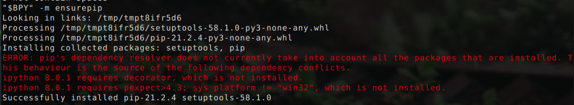
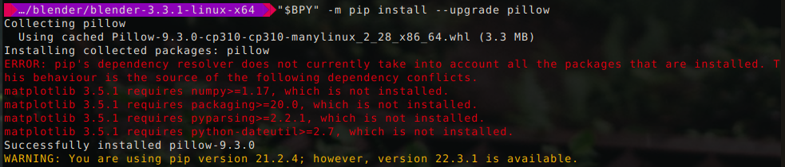
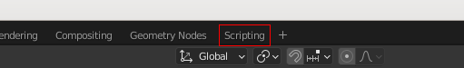

+++
title = "Blender Python Setup on Linux"
date = 2022-12-03
description = "I thought setting up Blender for python programming would be easy.  I was wrong - it took way too long to figure out how to make everything work.  This is more of a reminder to myself but hopefully others can find it useful as well."
+++

## Blender & Python

For anyone using Blender you will probably know it uses Python, which can interact with Blender to control objects, manipulate meshes, and more.

I personally like using it to play around with algorithms and generate meshes.  I will post more about this later, but for now let's focus on getting the environment setup for this.

## Installation script

Since manually downloading and extracting Blender doesn't install the `blender.desktop` file you won't have a shortcut for it in your menu.  Nor will `pip` be setup for use with the python version Blender ships (it is independent of the Python installed on your system).  Also it would be nice to store the location of Blender's custom Python executable in a variable, to make interacting with it easier.

Since this needs to be done every time you want to upgrade to a new version of Blender, I made a script.

### What it does

- downloads and extracts Blender to a specified location
- finds the path for Blender Python (no more digging around for it)
- sets up and installs the `blender.desktop` file (so you have a nice little shortcut for it)
- ensures `pip` is installed
- tells you what to add to your `.bashrc` file so you can always find Blender and its Python version

## Installing

At least on Linux it's not too hard to automate this setup.

1. Download [install_blender.sh](../assets/blender_python/install_blender.sh)
2. Open a terminal to the directory where you downloaded the `install_blender.sh` script
3. Make the script executable
    ```bash
    chmod +x install_blender.sh
    ```

4. Specify the version to install and where to install it 
    <details><summary>Find download link</summary>
    <ol>
    <li>Go to <a href="https://www.blender.org/about/website/" target="_blank" rel="noreferrer noopener">Blender.org > About > Website</a></li>
    <li>Choose a mirror under the section titled <b>External Mirrors</b></li>
    <li>Choose the <b>release</b> folder</li>
    <li>Choose the folder with the latest version</li>
    <li>Copy the link for the file ending with <code>-linux-x64.tar.xz</code></li>
    </ol>
    </details>

    ```bash
    BLENDER_URL=https://mirror.clarkson.edu/blender/release/Blender3.3/blender-3.3.1-linux-x64.tar.xz
    BLENDER_INSTALL=$HOME/bin/blender/
    ```

5. Run the `install_blender.sh` script
    
    ```bash
    ./install_blender.sh
    ```
    
    I got this error, but it still works:

    <figure>
        <a href="../assets/blender_python/blender_python_setup_errors.png" target="_blank">
            
        </a>
        <figcaption>I had an error message, but everything still works - it still says `Successfully installed pip`</figcaption>
    </figure>

### Testing it out

After adding the lines to your `.bashrc` file that were suggested by the install script, open a new terminal.

1. You can install any module but as an example I will use <a href="https://pillow.readthedocs.io/en/stable/" target="_blank" rel="noreferrer noopener">Pillow</a>:

    ```bash
    "$BPY" -m pip install --upgrade pillow
    ```

    <details>
    <summary>
    Just as with the installation I received an error - but it still works just fine
    </summary>
    <figure>
        <a href="../assets/blender_python/scripting_layout.png" target="_blank">
            
        </a>
        <figcaption>I ignored this</figcaption>
    </figure>
    </details>

2. Open blender and click the `Scripting` workspace

    <figure>
        <a href="../assets/blender_python/scripting_layout.png" target="_blank">
            
        </a>
    </figure>

3. In Blender's Python console type:
    
    ```
    import PIL
    ```
    
    It should just import the module without any errors.
    
    <figure>
        <a href="../assets/blender_python/import_pillow.png" target="_blank">
            
        </a>
    </figure>


## Importing local Python files

Frustratingly, Blender's python will not automatically resolve imports for local files.  To get around this I add the following to the top of the file I will be executing in Blender:

```python
import sys
import os
import bpy
dir = os.path.dirname(bpy.data.filepath)
if not dir in sys.path:
    sys.path.append(dir)
```

Now you can import python scripts from the folder where your `.blend` file is saved.

For example, if you had a python file called `zebra.py`, in the same directory as your `.blend` file, you would import it like:

```python
import zebra
```
