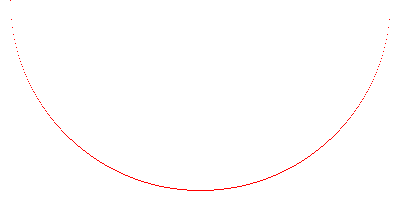
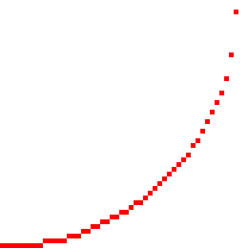

+++
title = "How to Draw a Circle"
date = 2022-09-23
description = "Recently I spent some time working on how to draw circles and arcs.  I needed to draw antialiased arcs, partial <dfn id=\"annulus-def\" title=\"Annulus: a filled donut shape\">annuli</dfn>, and antialiased circles but the library I was using didn't support them.  Graphics programming is interesting, and since there's nothing programmers love more than an interesting problem it was a great excuse to have a little fun."
# updated = 2022-09-23
+++

<!-- 
Recently I spent some time working on how to draw circles and arcs.  I needed to draw antialiased arcs, partial <dfn id="annulus-def" title="Annulus: a filled donut shape">annuli</dfn>, and antialiased circles but the library I was using didn't support them.  Graphics programming is interesting, and since there's nothing programmers love more than an interesting problem it was a great excuse to have a little fun.
-->

## Considerations for Drawing a Circle

The equation for a circle is: 

$$
x^2 + y^2 = r^2
$$

There are a few things to note here:

1. The actual values for `x` and `y` will be floating point numbers.  Unfortunately it's difficult to represent a fraction of a pixel in a normal image, so we'll have to somehow choose which values to draw.

2. The variables are squared, so negative values are lost.  If you think of the circle as being divided into quadrants each quadrant will still use the same numbers `x` and `y` but with either a positive or negative value for each coordinate.

3. The above formula for a circle assumes it's centered at (0, 0), however when drawing onto an image (0, 0) represents the top-left corner of the image and not the center.  For the final pixel locations in the image we will have to add the desired center coordinates.

If we have a circle with a radius of 10 and we use `x = 5` we get:

$$
y^2 = r^2 - x^2
\\\\
y^2 = 10^2 - 5^2
\\\\
y^2 = 100 - 25
\\\\
y^2 = 75
\\\\
y = \sqrt{75}
\\\\
y = 8.66
$$

So the actual point is (5, 8.66) but we need a whole number to put it onto an image, so we round to (5, 9). This is is important to remember: we are *approximating* the integer coordinates; the pixel drawn on the image doesn't represent the exact point on the circle.

As an example consider the following image where the grid lines represents a pixel's coordinates.  You can see how the actual coordinates lie somewhere between two pixels.


### Solving for `y`

In order to draw a circle we need somewhere to start drawing and to increment either the `x` or` y` value inside a loop.  A first attempt might start at `x = -radius` and loop until `x == radius`, finding the `y` value at each step.  Here is the python code:

```python
from PIL import Image, ImageColor
from math import pow, sqrt

# create a new 400x400 image with a white background
img = Image.new('RGB', (400, 400), (255, 255, 255))

color = (255, 0, 0)  # color to draw - red
c = (200, 200)  # center coordinates
r = 190  # radius

x = -r  # initial x value (center of circle
# remember the circle is centered at (0,0)

while x < r:
    # calculate y for the current x value
    y = round(sqrt(pow(r, 2) - pow(x, 2)))

    # draw a pixel at the (x, y) coordinates
    #   remember to add center since the circle is centered at (0,0)
    img.putpixel((x + c[0], y + c[1]), color)

    # increment x
    x = x + 1
img.save("naive_circle_attempt.png")
```

<center>The above code produces:</center>



<center>This zoomed-in image gives us a better look at the sides:</center>



This isn't exactly what we want but its close.  Let's examine what went wrong.

##### Why is there space between some of the pixels?

- Notice how there was always a pixel drawn from left to right (along the `x` axis) but vertically we missed a few.  This happens because we are always incrementing `x` inside the loop, and then solving for `y`.  So we only draw one pixel for each value of `x`, so there is only one `y` value for every `x` value.  If you look at an actual circle you will see we need multiple `y` values for certain `x` values.

##### But why are the gaps on just the right side?

- If you split the circle into eight pieces (octants) one axis will always increment and the other axis will *sometimes* increment.  In each octant one axis will always move faster than the other.  In the above image you can see that when the `y` axis starts moving faster than `x` we start seeing gaps in the circle.  This is because we started in octant 7 and once we moved into octant 8 the faster direction switched, but we kept incrementing `x`.

To solve this issue we have to know what part of the circle we are in.  The octant boundary can be found by checking to see if `x < y`, and if so `x` should move faster so we increment `x` every step.  Otherwise we increment `y` every step.  The value we are always incrementing can be referred to as the **fast** value, since it moves quicker, and the other axis is the **slow** value.  In order to actually draw a full circle we have to break it down into smaller sections.  First let's look at how quadrants can help us. 


## Quadrants

Since the formula for a circle only gives us positive values (due the squaring) we will have to break up our circle into four slices, or quadrants.  The quadrants will have the same numbers for (x, y) coordinates but differ in being negative or positive.

Squaring `x` and `y` will give us a positive value regardless of whether the original value was negative or positive.  To fix this we have to translate the coordinates depending on the quadrant.  The different values for the quadrants are: (x, y) (x, -y), (-x, -y) and (-x, y).

So a value of (5, 9), depending on the quadrant, could translate into: 

- (5, 9)

- (5, -9)

- (-5, -9)

- (-5, 9).

Here is some code to draw a circle by translating each pixel into all 4 quadrants:

```python
x = 0
y = r

# iterate over octant 7 and translate the coordinates for all 4 quadrants
while x < y:
    y = round(sqrt(pow(r, 2) - pow(x, 2)))

    # draw octant 7: (x, y)
    img.putpixel((x + c[0], y + c[1]), color)
    # draw octant 2: (x, -y)
    img.putpixel((x + c[0], -y + c[1]), color)
    # draw octant 3: (-x, -y)
    img.putpixel((-x + c[0], -y + c[1]), color)
    # draw octant 6: (-x, y)
    img.putpixel((-x + c[0], y + c[1]), color)

    x = x + 1

# iteratve over octant 8 and translate the coordinates for all 4 quadrants
while y != 0:
    x = round(sqrt(pow(r, 2) - pow(y, 2)))

    # draw octant 8: (x, y)
    img.putpixel((x + c[0], y + c[1]), color)
    # draw octant 1: (x, -y)
    img.putpixel((x + c[0], -y + c[1]), color)
    # draw octant 4: (-x, -y)
    img.putpixel((-x + c[0], -y + c[1]), color)
    # # draw octant 5: (-x, y)
    img.putpixel((-x + c[0], y + c[1]), color)

    y = y - 1

img.save("simple_circle_by_quadrant.png")
```


## Octants

The above code actually works on two octants, by switching which value is the fast value.  We could however just draw one octant and mirror it to the other 7.

### Translating Octants

You will still use the positive/negative values from the quadrants but also translate those coordinates into another octant.  Within a quadrant, one octant will have coordinates of (x, y) and the other will have (y, x).  So (5,9) would become (9, 5).  We can use this to mirror one octant to the other octant, which just rotates it by 45°.

> Note: swapping x and y to rotate 45° only works with a center of (0, 0).  If you need to convert between an image's actual coordinates you will have to subtract out the center coordinates.

<center>Octants</center>


### Looping Over Octants

To actually draw a circle we will want to loop over all of the pixels for an octant and translate those coordinates to the other 7.

#### While Loop

To loop over a single octant you can use:

```python
x = 0
y = r
while x < y:
    y = # calculate y
    x = x + 1
```

> Note: each quadrant will have different combination of negative and positive values for `x` and `y`.  You may have to use `-x` or `-y` according to which quadrant you want to work in.  Additionally, the fast and slow values will either increment or decrement depending on the octant.

#### For Loop

Or, you could also use a `for` loop to draw from 0 until the end of the octant.  The 45° point can be calculated by `round(r / sqrt(2))`:

```python
x = 0
for x in range(round(r / sqrt(2))):
    y = # calculate y
    x = x + 1
```

### Drawing a full circle with one octant

To draw a full circle by calculating just one octant you would take the (x, y) coordinates, and use all of the possible negative and positive combinations of (x, y) and (y, x).  You take the `x` and `y` values and translate for each octant.

Here is some python code:

```python
x = 0 # center of circle
y = r # bottom of circle

# iterate over octant 7 and translate the coordinates for all 4 quadrants
while x < y:
    # draw octant 7: (x, y)
    img.putpixel((x + c[0], y + c[1]), color)
    # draw octant 2: (x, -y)
    img.putpixel((x + c[0], -y + c[1]), color)
    # draw octant 3: (-x, -y)
    img.putpixel((-x + c[0], -y + c[1]), color)
    # draw octant 6: (-x, y)
    img.putpixel((-x + c[0], y + c[1]), color)
    # draw octant 8: (y, x)
    img.putpixel((y + c[0], x + c[1]), color)
    # draw octant 1: (y, -x)
    img.putpixel((y + c[0], -x + c[1]), color)
    # # draw octant 4: (-y, -x)
    img.putpixel((-y + c[0], -x + c[1]), color)
    # # # draw octant 5: (-y, x)
    img.putpixel((-y + c[0], x + c[1]), color)

    x = x + 1
    y = round(sqrt(pow(r, 2) - pow(x, 2)))
img.save("simple_circle_by_octant.png")
```


## Antialiasing

If `x` is the fast coordinate, we can use the `floor()` and `ceiling()` of `y` to get the two `y` coordinates to use with `x`. With an `x` value of 5 we can calculate `y = 8.66`. Using `floor(8.66)` and `ceiling(8.66)` we get the coordinates (5, 8) and (5, 9).

In order to make it look smooth we take an opacity of 100% and split it between the two pixels.  If the pixel lies exactly on the point it will have an opacity of 100% and the other will have 0%.

The fractional part of 8.66 is 0.66, which will be the opacity used for one of the pixels.  By subtracting that from 1, like  `1.0 - 0.66`, we will get the second opacity, giving us opacities of 0.66 and 0.34.

However, we don't want to just overwrite the colors at the given coordinates, we want to blend them in to the existing colors.  I won't cover alpha compositing here, but the idea is simple enough: take two colors and output one color in a way that blends them together to give a look of partial transparency.

Below is some python code to draw a single antialiased octant.  For simplicity I will leave out translating to the other octants.  Also note that the code creates a new image in the loop which is then blended into the existing image.  This step is done to avoid writing a custom function for alpha compositing for the two pixels.  If your image drawing library supports blending two pixels together (instead of just whole images) you should use that here instead.

```python
x = 0
y = r

# iterate over octant 7
for x in range(ffd):
    # create a new image to blend img with
    img2 = Image.new('RGBA', (400, 400), (255, 255, 255, 0))

    # get the exact value of y
    y = sqrt(pow(r, 2) - pow(x, 2))
    # get the fractional portion of y
    (fract, _) = modf(sqrt(pow(r, 2) - pow(x, 2)))

    # get the two closest pixel coordinates for y
    y1 = ceil(y)
    y2 = floor(y)

    # split the full opacity (255) between the two pixels
    o1 = round(255 * fract)
    o2 = 255 - o1

    # draw both pixels in octant 7
    img2.putpixel((x + c[0], y1 + c[1]), (color[0], color[1], color[2], o1))
    img2.putpixel((x + c[0], y2 + c[1]), (color[0], color[1], color[2], o2))

    # blend into existing image
    img.alpha_composite(img2)

    x = x + 1
img.save("simple_antialiased_octant.png")
```

<center>And here's the results up close:</center>


It should be noted there are other ways to implement simple antialiasing besides just splitting the opacity between the two nearest pixels.  You could use other weighting schemes for opacities or patterns for choosing which pixels to use.  For example, changing the how a desired is blended into the existing color based on whether the current pixel was a horizontal/vertical step or diagonal step.  Diagonal steps have a greater distance from the last pixel than horizontal or vertical steps so you could achieve better results by changing the blending for them.  Each have advantages and disadvantages.

For more code examples of antialiasing see:

- [Fast, Antialiased Circles and Ellipses from Xiaolin Wu's concepts | Yellow Splash](https://yellowsplash.wordpress.com/2009/10/23/fast-antialiased-circles-and-ellipses-from-xiaolin-wus-concepts/)

- [Anti-Aliased Algorithms - Landkey](http://www.landkey.net/d/antialiased/wu4_RF)


## Optimized Algorithms

While the code above works, and is fairly simple, it is unfortunately less efficient for modern computers.  Squaring and especially square roots are relatively expensive operations for processors.  Fortunately this can be sped up using different algorithms.

### Midpoint Circle Algorithm

The Midpoint Circle algorithm allows you to draw a circle without more expensive square root calculations.  It accomplishes this by testing the half-way point between two pixels to see if it is inside or outside of the circle.  It uses the formula for a circle:

$$ x^2 + y^2 - r^2 =0 $$

In each iteration of the loop it uses the last values of `x` and `y` and add (or subtract) 1 to the fast value, and 0.5 to the slow value and solves the equation above.

So if we're always incrementing `x` (the fast value) by 1 and then sometimes decrementing `y` (the slow value), we would get something like this In python:

```python
d = pow(x + 1.0, 2) + pow(y - 0.5, 2) - pow(r, 2)
inside = d <= 0 # store whether `d <= 0` is true or false
```

where `x` and `y` are the previously drawn values.

At each step we use the following to check whether the value, referred to here as `d`, is greater than or less than 0:
$$ x^2 + y^2 - r^2 = 0 $$ 

If `d` is less than 0 it lies inside the circle, and if it is is greater than 0 it lies outside the circle.  This is how we choose whether or not to move in the slow direction.  If it is less than 0 we do not move in the slow direction, just the fast direction.

Below is some python code to draw a single octant.  The other octants can be drawn using the same technique above to translate the octant's coordinates.

```python
from PIL import Image
from math import pow

# create a new 400x400 image with a white background
img = Image.new('RGB', (400, 400), (255, 255, 255))

color = (255, 0, 0)  # color to draw - red
c = (200, 200)  # center coordinates
r = 150  # radius


x = 0
y = r
while x < y:
    img.putpixel((x + c[0], y + c[1]), color)

    # test whether fast+1 and slow-0.5 is inside or outside the circle
    p = pow(x + 1.0, 2) + pow(y - 0.5, 2) - pow(r, 2)
    if p <= 0:
        x = x+1  # inside the circle - only move in the fast direction
    else:
        # outside circle - move in both directions
        x = x+1
        y = y-1
img.save("midpoint_octant.png")
```

This can be further optimized to avoid squaring, but this represents the basics of how the algorithm works.  I suggest taking a look at the following for more details and how to avoid squaring:

- [Mid-Point Circle Drawing Algorithm - LectureLoops](https://lectureloops.com/mid-point-circle-drawing-algorithm/)

- [Computer Graphics Midpoint Circle Algorithm - Javatpoint](https://www.javatpoint.com/computer-graphics-midpoint-circle-algorithm)

- [Mid-Point Circle Drawing Algorithm - GeeksforGeeks](https://www.geeksforgeeks.org/mid-point-circle-drawing-algorithm/)

### Bresenham's Algorithm

Everything above assumes we're using floating point variables to calculate values.  While the extra precision is convenient, it's not necessary for drawing circles.

> I won't cover the reasons to use integers over floating point numbers here, but there are some important details to consider when making that choice (like Epsilon values and performance).  I will add another blog post to discuss the choice of integers over floats.
> 
> It should be noted that using integers makes it more difficult to implement antialiasing, [but not impossible](http://www.landkey.net/d/antialiased/wu4_RF/Content/WU/src/NoSqrt.java.htm).

Bresenham's circle algorithm is a modification of the Midpoint Circle algorithm that removes floating point numbers, allowing it to work just with integers.  I won't explain the math here, but here is some python code demonstrating how it works:

```python
x = 0
y = r
d = 3 - 2 * r  # radius error
ffd = round(r / sqrt(2))  # forty-five degree point where octants change

# iterate over octant 7
for x in range(ffd):
    img.putpixel((x + c[0], y + c[1]), color)
    x = x + 1
    if d <= 0:
        d += 4 * x + 6
    else:
        y = y - 1
        d += 4 * (x - y) + 10
img.save("bresenham_octant.png")
```

For more on Bresenham's Circle Algorithm I highly recommend:

- [How to Draw a Circle - Everett Gaius Vergara](https://www.everettgaius.com/article/how-draw-circle-midpoint-and-bresenhams-algorithm) - an excellent article covering both the Midpoint Circle algorithm and Bresenham's algorithm as well as mathematical derivations and code examples

- [Mid-Point Circle Drawing Algorithm - Lectureloops](https://lectureloops.com/bresenhams-circle-drawing-algorithm/) - a good explanation of the math
  
  - Also their [Computer Graphics](https://lectureloops.com/category/uncategorized/computer-science/computer-graphics/) section may be worth checking out.

- [Bresenham’s circle drawing algorithm - Geeks for Geeks](https://www.geeksforgeeks.org/bresenhams-circle-drawing-algorithm/)
