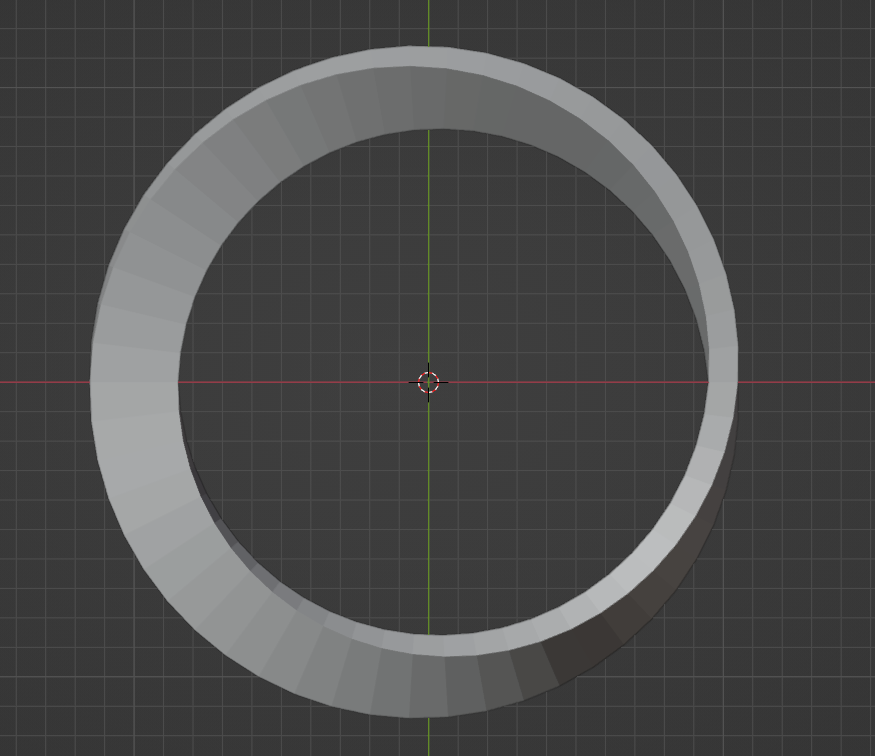
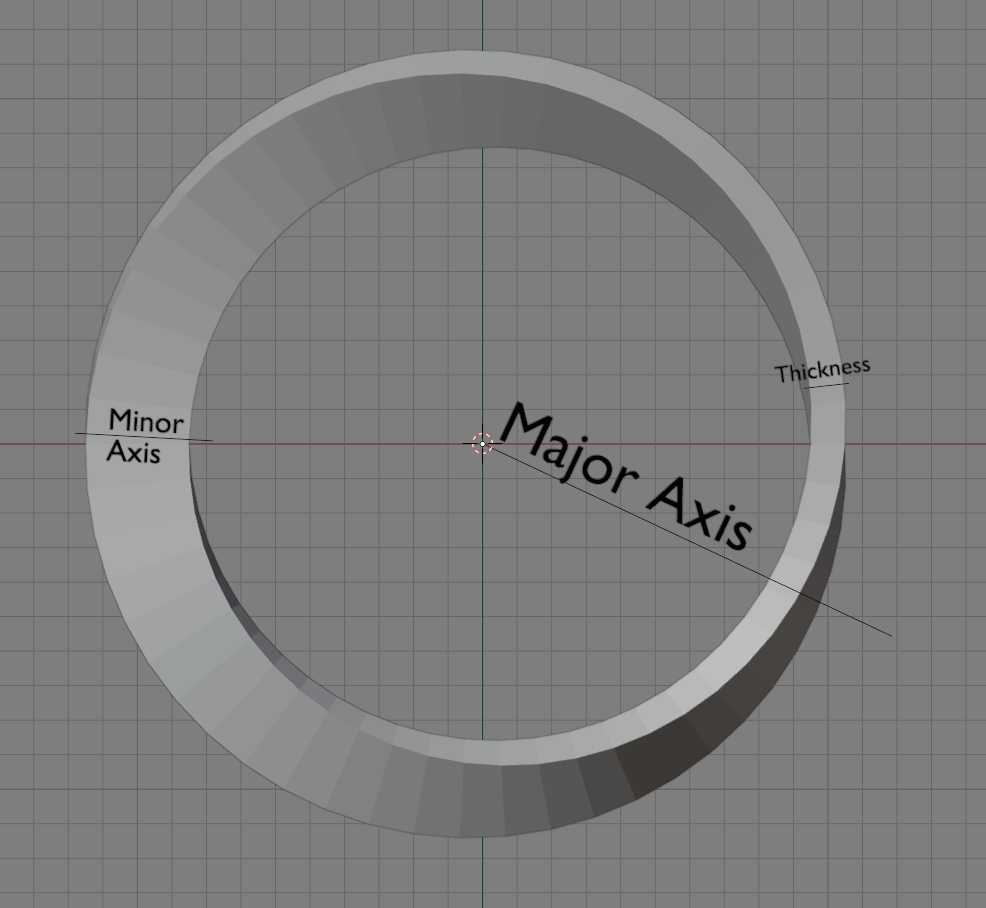
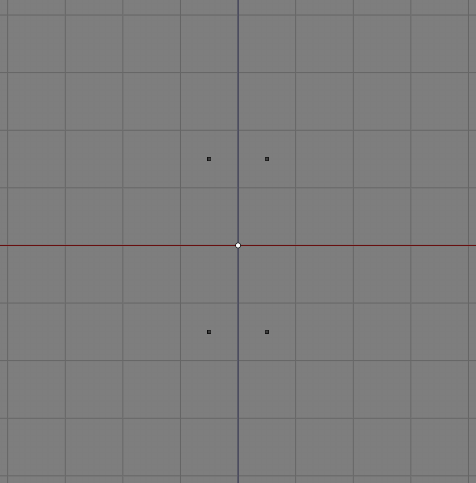
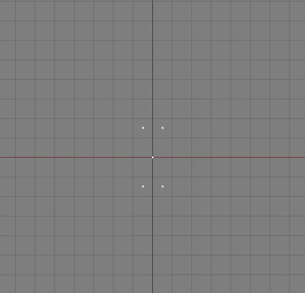
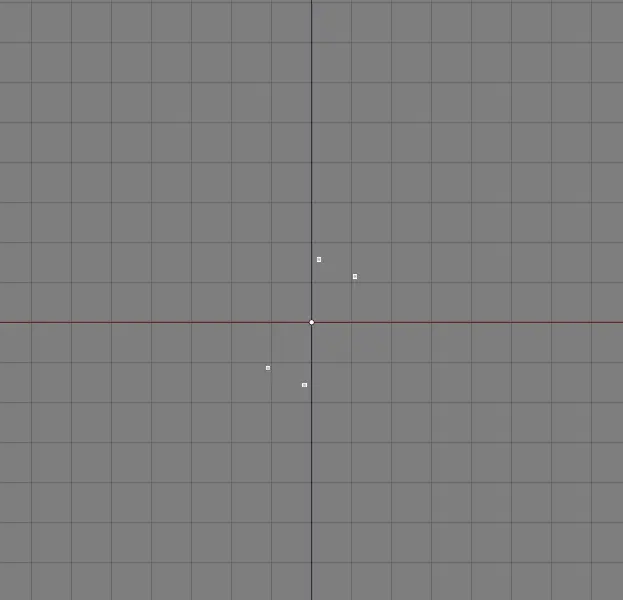
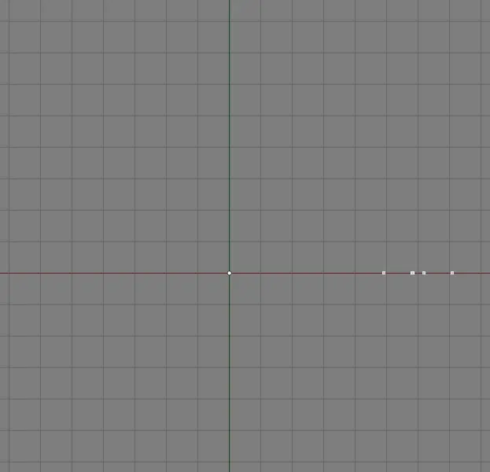
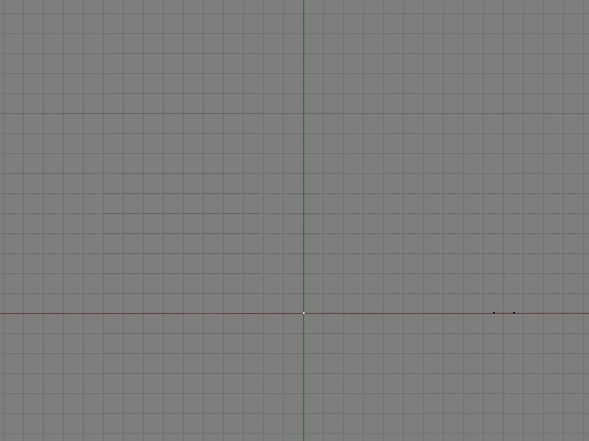
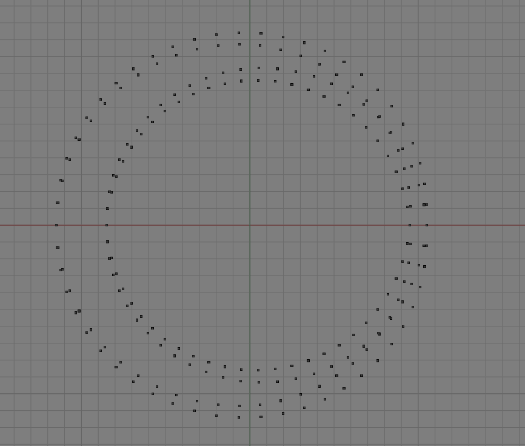

+++
title = "3d Mobius Strip"
date = 2022-12-13
updated = 2022-12-15
description = "The purpose of this article to clearly explain how to create a Mobius Strip in Blender using Python.  Technically it's a Mobius Ring since it is a 3d object, but I'll refer to it as a Mobius Strip since that will be a more familiar term for most people.  The goal here is not to explain terminology but to explain the process and give a clear understanding of how the code works and why."
+++

<figure>
    <a href="../assets/mobius_strip/mobius_strip_rendered.png">
        
    </a>
    <figcaption>The final product</figcaption>
</figure>


## Getting started


First I'll describe the steps needed to make a 3d mobius strip then we'll implement those steps in Python code.

> If you aren't familiar with using Python in Blender I'd recommend reading my article on [Setting up Blender](@/blender_python_setup.md).  It is written for Linux, but the section [Importing local Python files](@/blender_python_setup.md#importing-local-python-files) applies to all operating systems and will help make it easier to run Python code.


## General Overview

We will loop over a specified `resolution`, creating 4 vertices at each iteration, and then apply some transformations to move and rotate them into the correct positions.  This will create all of the vertices needed for the mesh.  I will not demonstrate creating edges or faces here and leave that for the code; the most important part here is understanding the steps taken to make the general shape.

### Axes

<figure>
<figcaption class="title"><h5>Front view</h5></figcaption>
<a href="../assets/mobius_strip/axes_thickness.png">

</a>
<figcaption>The vertices form a rectangle</figcaption>
</figure>

**Note**: we will be using the y axis in Blender as the minor axis and z as the major axis, rotations will be applied around these axes (like rotating around a cylinder or a pole).

### Steps

<ol>
    <li id="step-1">Create 4 vertices.  The width between the vertices is the <code>thickness</code> (distance between front and back sides) and the height is the <code>minor_radius</code> (how tall it should be).
        <figure>
        <figcaption class="title"><h5>Front view</h5></figcaption>
        <a href="../assets/mobius_strip/verts_centered.png">
        
        </a>
        <figcaption>The vertices form a rectangle</figcaption>
        </figure>
    </li>
    <li id="step-2">Rotate those vertices around the minor axis
        <figure>
        <figcaption class="title"><h5>Front view</h5></figcaption>
        <a href="../assets/mobius_strip/step2_rotate_minor_axis.webp">
        
        </a>
        <figcaption>Rotate around minor axis</figcaption>
        </figure>
    </li>
    <li id="step-3">Move the vertices <code>major_radius</code> away from the center
        <figure>
        <figcaption class="title"><h5>Front view</h5></figcaption>
        <a href="../assets/mobius_strip/step3_move_vertices.webp">
        
        </a>
        <figcaption>Rotate around minor axis</figcaption>
        </figure>
    </li>
    <li id="step-4">Rotate the vertices around the major axis
        <figure>
        <figcaption class="title"><h5>Top view</h5></figcaption>
        <a href="../assets/mobius_strip/step4_rotate_major_axis.webp">
        
        </a>
        <figcaption>Rotate around major axis</figcaption>
        </figure>
    </li>
</ol>


Here are the vertices after each loop iteration:

<figure>
<figcaption class="title"><h5>Top view</h5></figcaption>
<a href="../assets/mobius_strip/add.webp">

</a>
<figcaption>First half of the loop</figcaption>
</figure>

Then we just repeat this for the rest of the loop and we will have placed all of our vertices.

<figure>
<figcaption class="title"><h5>Top view</h5></figcaption>
<a href="../assets/mobius_strip/verts_complete.png">
    
</a>
<figcaption>All of the vertices after completing the loop</figcaption>
</figure>


## Python Code

We will be using Blender's [Mathutils](https://docs.blender.org/api/current/mathutils.html) module - specifically the [Vector](https://docs.blender.org/api/current/mathutils.html#mathutils.Vector) and [Matrix](https://docs.blender.org/api/current/mathutils.html#mathutils.Matrix) types.  Vector will be used to store 3d coordinates and Matrix will be used to rotate the coordinates.

Note: just like above we will be using the y axis as our minor axis, and z as our major axis.

### Imports

Let's import some math libraries and Blender's Python utilities:

```python
import bpy
from math import *
from mathutils import Vector, Matrix
```

### Helpers

Let's define an `apply` function to multiply a 3d coordinate (vector) with a matrix in order to rotate it:

```python
def apply(matrix, vector):
    '''
    apply(matrix, vector) -> vector

    this function receives a matrix and a vector and returns
    the vector obtained by multipling each row of the matrix
    with the vector
    '''
    V_0 = vector @ matrix[0]
    V_1 = vector @ matrix[1]
    V_2 = vector @ matrix[2]
    return Vector((V_0, V_1, V_2))
```

We'll talk more about matrices later.

### Variables

We'll create a function with some user-defined variables:

```python
def mobius(major_radius: float = 1, minor_radius: float = 0.15, thick: float = 0.1, resolution: int = 108):
    '''
    major_radius - how large the strip will be
    minor_radius - defines how tall the strip will be (surface width)
    thick        - distance between front and back sides
    resolution   - number of loop iterations to perform
    '''
```

Initalize an empty list to hold our vertices and eventually faces:

```python
verts = []
faces = []
```

And finally create a variable that represents the distance to move the vertices away from the center, which will be used later (shown in <a href="#step-3">step 3</a> from earlier):

```python
dx = Vector([major_radius, 0, 0])
```

When added to another vector this will move the vertices `major_radius` units away from the center, which will be applied before rotating around the major axis.  We store the distance in the x coordinate to move vertices horizontally before rotating around the z axis (<a href="#step-4">in step 4</a>).


### Adding vertices

Let's define our main loop:

```python
for i in range(resolution):
    # the angle to rotate around the minor axis (covers a 180° rotation)
    phi = pi * i / resolution
    
    # the angle to rotate around the major axis (covers a 360° rotation)
    theta = phi * 2
    
    # how many vertices do we have in our list
    idx = len(verts)
```

In the loop body we define two angles, represented in [Radians](https://en.wikipedia.org/wiki/Radian).  The angles will be gradually increased as `i` is incremented.

`phi` represents the angle to rotate around the minor axis (<a href="#step-2">step 2</a> from earlier).  It will end up covering a 180&deg; rotation, which means it will only be rotated half way.  This is how we rotate the surface of the mobius strip.  The vertices of the last loop iteration will rotated 180&deg; so the top of those vertices will connect to the bottom of the vertices from the first loop iteration and vice versa.

`theta` represents the angle to rotate around the major axis (<a href="#step-3">step 3</a> from earlier).  It will end up covering a 360&deg; rotation, which means it will be rotated all the way around.  This is how we get an overall circular shape.

`idx` is our current position in the list of vertices.  We will use this later to create faces between the vertices.

#### Initial vertices

In the body of the loop we'll create our initial points (<a href="#step-1">step 1</a> from earlier):

```python
p0 = Vector(( -thick/2, 0,  minor_radius ))
p1 = Vector((  thick/2, 0,  minor_radius ))
p2 = Vector((  thick/2, 0, -minor_radius ))
p3 = Vector(( -thick/2, 0, -minor_radius ))
```

Since the four vertices will initially be a rectangle be centered around `(0, 0)`, we can just specify the coordinates we want.  The thickness is divided by 2 because `thick` defines the total thickness, not the distance from the center (although that detail is less important since we could have just defined `thick = 0.05` instead of using `0.1`).

#### Defining Rotation Matrices

In order to create the mesh we'll need to use a little math.  If you're not familiar with rotation matrices that's *ok*, the most important thing to know is that we can multiply a vector (which stores the `(x,y,z` coordinates) by a matrix in order to rotate the coordinates.  For more detailed information on how this works see [Wikipedia - Rotation matrix](https://en.wikipedia.org/wiki/Rotation_matrix) or [Stack Exchange - Understanding rotation matrices](https://math.stackexchange.com/questions/363652/understanding-rotation-matrices).

Here we create a couple rotation matrices to rotate our vertices around the major and minor axes:

```python
# Rotates along major radius
# angle=theta, size=3, axis=[0, 0, 1]
rot_theta = Matrix.Rotation(theta, 3, [0, 0, 1])

# Rotates along minor radius
# angle=phi, size=3, axis=[0, 1, 0]
rot_phi = Matrix.Rotation(phi, 3, [0, 1, 0])
```

`rot_theta` uses `[0, 0, 1]` to specify a rotation around the z axis while `rot_phi` uses `[0, 1, 0]` to specify a rotation around the y axis.  The size is set to 3 because we want a 3-dimensional matrix.

#### Transforms

We will need to perform three operations on the vertices:

1. Rotate around the minor axis (as seen in <a href="#step-2">step 2</a>)

    ```python
    p0_rotated = apply(rot_phi, p0)
    p1_rotated = apply(rot_phi, p1)
    p2_rotated = apply(rot_phi, p2)
    p3_rotated = apply(rot_phi, p3)
    ```
    
    We are using the `apply()` function from earlier to multiply each row of the rotation matrix by the 3d coordinates in the vector:

2. Move the vertices away from the center (horizontally, as seen in <a href="#step-3">step 3</a>)

    ```python
    p0_moved = p0_rotated + dx
    p1_moved = p1_rotated + dx
    p2_moved = p2_rotated + dx
    p3_moved = p3_rotated + dx
    ```
    
3. Rotate around the major axis to get our final vertices (as seen in <a href="#step-4">step 4</a>)

    ```python
    v0 =  apply(rot_theta, p0_moved)
    v1 =  apply(rot_theta, p1_moved)
    v2 =  apply(rot_theta, p2_moved)
    v3 =  apply(rot_theta, p3_moved)
    ```

Then we will add those vertices to our list of vertices with:

```python
verts.extend([v0, v1, v2, v3])
```

### Faces

Faces are added by connecting multiple vertices.  Each vertice is referenced by its position in the `verts` list.

1. First we identify the next vertices that will be added, assuming we are not at the end:

    ```python
    # `idx` represents the position of the first newly added vertice
    # so since we want the position of the next vertices we add 4 to that
    next_verts = idx + 4

    # If we are not at the end of the loop we find the index positions
    # of the next vertices in the `verts` list
    if i+1 < resolution:
        n0 = next_verts + 0
        n1 = next_verts + 1
        n2 = next_verts + 2
        n3 = next_verts + 3
    ```

2. If we are at the end we handle that differently:

    ```python
    # Otherwise reference the vertices created the very first loop iteration
    else:
        n0 =  2
        n1 =  3
        n2 =  0
        n3 =  1
    ```

    Remember the top and bottoms get switched at the end because it will be rotated by 180°, so the vertices do not have an obviousordering.

3. And finally let's create those faces in our list:

    ```python
    faces.append([idx+0, idx+1, n1, n0])  # top face
    faces.append([idx+1, idx+2, n2, n1])  # front side face
    faces.append([idx+2, idx+3, n3, n2])  # bottom face
    faces.append([idx+3, idx+0, n0, n3])  # back side face
    ```
    
    > Remember `idx` is the position of the first newly added vertice in the list

### Adding the mesh

Once the loop is finished we can use the `verts` and `faces` lists to create our mesh using [`from_pydata()`](https://docs.blender.org/api/current/bpy.types.Mesh.html#bpy.types.Mesh.from_pydata) and validate using [`validate()`](https://docs.blender.org/api/current/bpy.types.Mesh.html#bpy.types.Mesh.validate) (which returns `true` if the mesh is invalid).

```python
# Create a blank mesh
mesh = bpy.data.meshes.new("mobius_strip")

# Create a mesh from the given vertices and faces
mesh.from_pydata(verts, [], faces)

# Ensure the mesh is valid
if mesh.validate():
    print('Invalid mesh')
    return

# Create a new object
ob = bpy.data.objects.new("Mobius Strip Mesh", mesh)

# Add our object to the current collection
bpy.context.collection.objects.link(ob)
```

<figure>
    <figcaption class="title">Final mesh</figcaption>
    <a href="../assets/mobius_strip/mobius_strip_rendered.png">
        
    </a>
    <figcaption>Final mesh with faces</figcaption>
</figure>

## Final code

Here is the code:

```python
import bpy
from math import *
from mathutils import Vector, Matrix

def apply(matrix, vector):
    '''
    apply(matrix, vector) -> vector

    this function receives a matrix and a vector and returns
    the vector obtained by multipling each row of the matrix
    with the vector
    '''
    V_0 = vector @ matrix[0]
    V_1 = vector @ matrix[1]
    V_2 = vector @ matrix[2]
    return Vector((V_0, V_1, V_2))

def mobius(major_radius: float = 1, minor_radius: float = 0.15, thick: float = 0.1, resolution: int = 108):
    '''
    major_radius - how large the strip will be
    minor_radius - defines how tall the strip will be (surface width)
    thick        - distance between front and back sides
    resolution   - number of loop iterations to perform
    '''

    verts = []
    faces = []
    dx = Vector([major_radius, 0, 0])

    for i in range(resolution):
        # the angle to rotate around the minor axis (covers a 180° rotation)
        phi = pi * i / resolution
        
        # the angle to rotate around the major axis (covers a 360° rotation)
        theta = phi * 2
        
        # how many vertices do we have in our list
        idx = len(verts)

        p0 = Vector(( -thick/2, 0,  minor_radius ))
        p1 = Vector((  thick/2, 0,  minor_radius ))
        p2 = Vector((  thick/2, 0, -minor_radius ))
        p3 = Vector(( -thick/2, 0, -minor_radius ))

        # Rotates along major radius
        # angle=theta, size=3, axis=[0, 0, 1]
        rot_theta = Matrix.Rotation(theta, 3, [0, 0, 1])

        # Rotates along minor radius
        # angle=phi, size=3, axis=[0, 1, 0]
        rot_phi = Matrix.Rotation(phi, 3, [0, 1, 0])

        p0_rotated = apply(rot_phi, p0)
        p1_rotated = apply(rot_phi, p1)
        p2_rotated = apply(rot_phi, p2)
        p3_rotated = apply(rot_phi, p3)

        p0_moved = p0_rotated + dx
        p1_moved = p1_rotated + dx
        p2_moved = p2_rotated + dx
        p3_moved = p3_rotated + dx

        v0 =  apply(rot_theta, p0_moved)
        v1 =  apply(rot_theta, p1_moved)
        v2 =  apply(rot_theta, p2_moved)
        v3 =  apply(rot_theta, p3_moved)

        verts.extend([v0, v1, v2, v3])

        # `idx` represents the position of the first newly added vertice
        # so since we want the position of the next vertices we add 4 to that
        next_verts = idx + 4

        # If we are not at the end of the loop we find the index positions
        # of the next vertices in the `verts` list
        if i+1 < resolution:
            n0 = next_verts + 0
            n1 = next_verts + 1
            n2 = next_verts + 2
            n3 = next_verts + 3
        # Otherwise reference the vertices created the very first loop iteration
        else:
            n0 =  2
            n1 =  3
            n2 =  0
            n3 =  1
        faces.append([idx+0, idx+1, n1, n0])  # top face
        faces.append([idx+1, idx+2, n2, n1])  # front side face
        faces.append([idx+2, idx+3, n3, n2])  # bottom face
        faces.append([idx+3, idx+0, n0, n3])  # back side face

    # Create a blank mesh
    mesh = bpy.data.meshes.new("mobius_strip")

    # Create a mesh from the given vertices and faces
    mesh.from_pydata(verts, [], faces)

    # Ensure the mesh is valid
    if mesh.validate():
        print('Invalid mesh')
        return

    # Create a new object
    ob = bpy.data.objects.new("Mobius Strip Mesh", mesh)

    # Add our object to the current collection
    bpy.context.collection.objects.link(ob)

# run the function
mobius()
```

You can just paste that code into new a Blender text document and press the Run icon (the triangle) and a 3d mobius strip will appear!

### Download

Or you can download the final code here:
[mobius_strip.py](../assets/mobius_strip/mobius_strip.py)

## Credits

This article is basically a much more verbose explanation and reimplementation of the code from [this Stack Exchange post](https://blender.stackexchange.com/questions/82480/how-to-make-a-mobius-strip/168967#168967)
